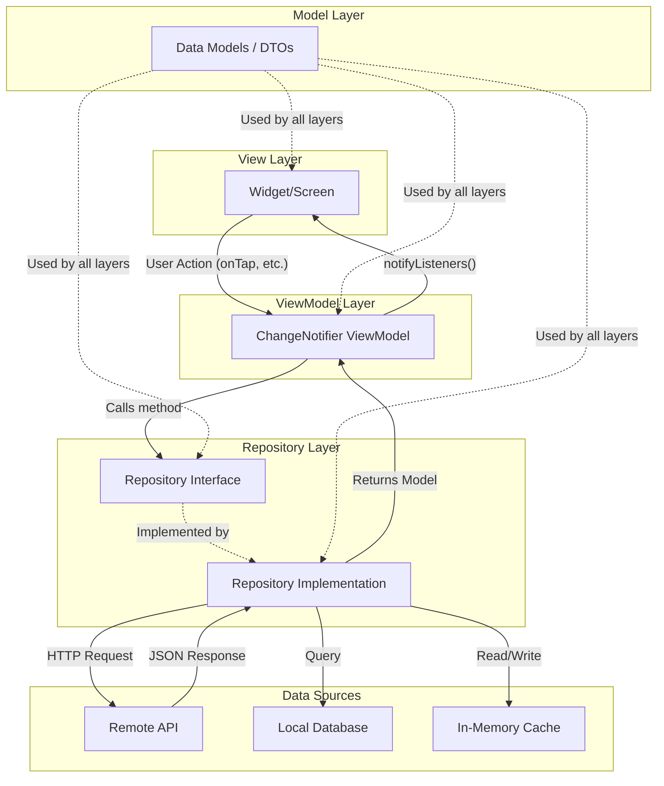

# Flutter MVVM Architecture Guide

This document defines the MVVM (Model-View-ViewModel) architecture used across all Flutter projects in the pipeline. Every Flutter Developer agent and the Mobile Team Lead MUST follow these patterns exactly.

---

## 1. Architecture Overview

MVVM separates the application into distinct layers with strict boundaries. Data flows in one direction through the layers, and each layer has a single responsibility.

```
┌─────────────────────────────────────────────┐
│                   VIEW                       │
│  (Widgets, Screens, UI Components)          │
│  • Renders UI based on ViewModel state      │
│  • Delegates user actions to ViewModel      │
│  • NEVER contains business logic            │
├─────────────────────────────────────────────┤
│                VIEWMODEL                     │
│  (Business Logic, State Management)         │
│  • Holds and manages UI state               │
│  • Transforms data for display              │
│  • Calls repositories for data operations   │
│  • NEVER references UI/widgets              │
├─────────────────────────────────────────────┤
│               REPOSITORY                     │
│  (Data Access Abstraction)                  │
│  • Abstract interface + implementation      │
│  • Handles API calls, local storage         │
│  • Returns domain models                    │
│  • NEVER knows about UI or ViewModels       │
├─────────────────────────────────────────────┤
│                 MODEL                        │
│  (Data Classes, DTOs, Entities)             │
│  • Pure Dart classes                        │
│  • Serialization (fromJson/toJson)          │
│  • Value equality                           │
│  • NEVER imports Flutter packages           │
└─────────────────────────────────────────────┘
```

### Data Flow



---

## 2. Layer Definitions with Strict Boundaries

### 2.1 Model Layer

**Purpose:** Define data structures used throughout the application.

**Contains:**
- Data classes (entities, DTOs)
- API response/request models
- Enums and constants related to data
- Type definitions (`typedef`)

**Strict Rules:**
| ✅ Allowed | ❌ Forbidden |
|-----------|-------------|
| `import 'dart:core'` | `import 'package:flutter/...'` |
| `import 'package:equatable/...'` | `import 'package:provider/...'` |
| `import 'dart:convert'` | Business logic methods |
| Pure data fields | Network calls |
| `fromJson` / `toJson` | State management |
| `copyWith` methods | UI references |
| Validation of data format | Side effects |

**Example: Complete Model**

```dart
import 'package:equatable/equatable.dart';

/// Represents a product in the catalog.
///
/// Products are fetched from the API and displayed in the
/// product list and detail screens.
class ProductModel extends Equatable {
  /// Server-assigned unique identifier.
  final String id;

  /// Product display name.
  final String name;

  /// Product description, may contain markdown.
  final String description;

  /// Price in cents (integer to avoid floating point issues).
  final int priceInCents;

  /// URL to the product's primary image.
  final String imageUrl;

  /// Product category for filtering.
  final ProductCategory category;

  /// Whether the product is currently in stock.
  final bool isAvailable;

  /// Timestamp of when the product was last updated.
  final DateTime updatedAt;

  /// Optional list of tags for search/filtering.
  final List<String> tags;

  const ProductModel({
    required this.id,
    required this.name,
    required this.description,
    required this.priceInCents,
    required this.imageUrl,
    required this.category,
    required this.isAvailable,
    required this.updatedAt,
    this.tags = const [],
  });

  /// Formatted price string (e.g., "$12.99").
  String get formattedPrice {
    final dollars = priceInCents ~/ 100;
    final cents = priceInCents % 100;
    return '\$$dollars.${cents.toString().padLeft(2, '0')}';
  }

  factory ProductModel.fromJson(Map<String, dynamic> json) {
    return ProductModel(
      id: json['id'] as String,
      name: json['name'] as String,
      description: json['description'] as String,
      priceInCents: json['price_in_cents'] as int,
      imageUrl: json['image_url'] as String,
      category: ProductCategory.fromString(json['category'] as String),
      isAvailable: json['is_available'] as bool? ?? true,
      updatedAt: DateTime.parse(json['updated_at'] as String),
      tags: (json['tags'] as List<dynamic>?)
              ?.map((e) => e as String)
              .toList() ??
          const [],
    );
  }

  Map<String, dynamic> toJson() {
    return {
      'id': id,
      'name': name,
      'description': description,
      'price_in_cents': priceInCents,
      'image_url': imageUrl,
      'category': category.value,
      'is_available': isAvailable,
      'updated_at': updatedAt.toIso8601String(),
      'tags': tags,
    };
  }

  ProductModel copyWith({
    String? id,
    String? name,
    String? description,
    int? priceInCents,
    String? imageUrl,
    ProductCategory? category,
    bool? isAvailable,
    DateTime? updatedAt,
    List<String>? tags,
  }) {
    return ProductModel(
      id: id ?? this.id,
      name: name ?? this.name,
      description: description ?? this.description,
      priceInCents: priceInCents ?? this.priceInCents,
      imageUrl: imageUrl ?? this.imageUrl,
      category: category ?? this.category,
      isAvailable: isAvailable ?? this.isAvailable,
      updatedAt: updatedAt ?? this.updatedAt,
      tags: tags ?? this.tags,
    );
  }

  @override
  List<Object?> get props => [
        id, name, description, priceInCents, imageUrl,
        category, isAvailable, updatedAt, tags,
      ];
}

/// Product categories for filtering and organization.
enum ProductCategory {
  electronics('electronics'),
  clothing('clothing'),
  food('food'),
  books('books'),
  other('other');

  final String value;
  const ProductCategory(this.value);

  factory ProductCategory.fromString(String value) {
    return ProductCategory.values.firstWhere(
      (e) => e.value == value,
      orElse: () => ProductCategory.other,
    );
  }
}
```

### 2.2 Repository Layer

**Purpose:** Abstract data access. Provide a clean interface between ViewModels and data sources.

**Contains:**
- Abstract repository interfaces
- Concrete repository implementations
- Data source adapters (API clients, database DAOs)
- Caching logic

**Strict Rules:**
| ✅ Allowed | ❌ Forbidden |
|-----------|-------------|
| `import 'dart:convert'` | `import 'package:flutter/...'` |
| `import 'package:http/...'` | `import 'package:provider/...'` |
| Model imports | ViewModel imports |
| Network/DB operations | UI references |
| Error transformation | `BuildContext` usage |
| Caching strategies | `notifyListeners()` |

**Pattern: Interface + Implementation**

```dart
// file: lib/core/repositories/product_repository.dart
/// Interface for product data operations.
///
/// All data access for products goes through this interface,
/// allowing for easy testing and swapping of implementations.
abstract class ProductRepository {
  /// Retrieves all products, optionally filtered by [category].
  ///
  /// Returns an empty list if no products match.
  /// Throws [ApiException] on network failures.
  Future<List<ProductModel>> getProducts({ProductCategory? category});

  /// Retrieves a single product by its [id].
  ///
  /// Throws [NotFoundException] if no product exists with the given ID.
  /// Throws [ApiException] on network failures.
  Future<ProductModel> getProductById(String id);

  /// Searches products by [query] string.
  ///
  /// Searches against product name, description, and tags.
  /// Returns an empty list if no matches found.
  Future<List<ProductModel>> searchProducts(String query);
}
```

```dart
// file: lib/features/products/repositories/product_repository_impl.dart
import 'dart:convert';
import 'package:http/http.dart' as http;

/// REST API implementation of [ProductRepository].
class ProductRepositoryImpl implements ProductRepository {
  final http.Client _client;
  final String _baseUrl;

  // Simple in-memory cache
  List<ProductModel>? _cachedProducts;
  DateTime? _cacheTimestamp;
  static const _cacheDuration = Duration(minutes: 5);

  ProductRepositoryImpl({
    required http.Client client,
    required String baseUrl,
  })  : _client = client,
        _baseUrl = baseUrl;

  bool get _isCacheValid =>
      _cachedProducts != null &&
      _cacheTimestamp != null &&
      DateTime.now().difference(_cacheTimestamp!) < _cacheDuration;

  @override
  Future<List<ProductModel>> getProducts({ProductCategory? category}) async {
    // Return cached data if valid
    if (_isCacheValid && category == null) {
      return _cachedProducts!;
    }

    try {
      final queryParams = <String, String>{};
      if (category != null) {
        queryParams['category'] = category.value;
      }

      final uri = Uri.parse('$_baseUrl/products').replace(
        queryParameters: queryParams.isNotEmpty ? queryParams : null,
      );

      final response = await _client.get(
        uri,
        headers: {'Content-Type': 'application/json'},
      );

      if (response.statusCode == 200) {
        final List<dynamic> jsonList =
            json.decode(response.body) as List<dynamic>;
        final products = jsonList
            .map((e) => ProductModel.fromJson(e as Map<String, dynamic>))
            .toList();

        // Update cache for unfiltered requests
        if (category == null) {
          _cachedProducts = products;
          _cacheTimestamp = DateTime.now();
        }

        return products;
      } else {
        throw ApiException(
          message: 'Failed to load products',
          statusCode: response.statusCode,
        );
      }
    } on http.ClientException catch (e) {
      throw ApiException(message: 'Network error: ${e.message}');
    } on FormatException {
      throw ApiException(message: 'Invalid response format from server');
    }
  }

  @override
  Future<ProductModel> getProductById(String id) async {
    // Check cache first
    if (_isCacheValid) {
      final cached = _cachedProducts!.where((p) => p.id == id);
      if (cached.isNotEmpty) return cached.first;
    }

    try {
      final response = await _client.get(
        Uri.parse('$_baseUrl/products/$id'),
        headers: {'Content-Type': 'application/json'},
      );

      if (response.statusCode == 200) {
        return ProductModel.fromJson(
          json.decode(response.body) as Map<String, dynamic>,
        );
      } else if (response.statusCode == 404) {
        throw NotFoundException(message: 'Product not found: $id');
      } else {
        throw ApiException(
          message: 'Failed to load product',
          statusCode: response.statusCode,
        );
      }
    } on http.ClientException catch (e) {
      throw ApiException(message: 'Network error: ${e.message}');
    }
  }

  @override
  Future<List<ProductModel>> searchProducts(String query) async {
    try {
      final response = await _client.get(
        Uri.parse('$_baseUrl/products/search')
            .replace(queryParameters: {'q': query}),
        headers: {'Content-Type': 'application/json'},
      );

      if (response.statusCode == 200) {
        final List<dynamic> jsonList =
            json.decode(response.body) as List<dynamic>;
        return jsonList
            .map((e) => ProductModel.fromJson(e as Map<String, dynamic>))
            .toList();
      } else {
        throw ApiException(
          message: 'Search failed',
          statusCode: response.statusCode,
        );
      }
    } on http.ClientException catch (e) {
      throw ApiException(message: 'Network error: ${e.message}');
    }
  }

  /// Invalidates the in-memory cache.
  void clearCache() {
    _cachedProducts = null;
    _cacheTimestamp = null;
  }
}
```

**Pattern: Custom Exception Classes**

```dart
// file: lib/core/models/app_exceptions.dart

/// Base exception for all application-specific errors.
abstract class AppException implements Exception {
  final String message;
  final int? statusCode;

  const AppException({required this.message, this.statusCode});

  @override
  String toString() => '$runtimeType: $message (status: $statusCode)';
}

/// Thrown when an API request fails.
class ApiException extends AppException {
  const ApiException({required super.message, super.statusCode});
}

/// Thrown when a requested resource is not found.
class NotFoundException extends AppException {
  const NotFoundException({required super.message})
      : super(statusCode: 404);
}

/// Thrown when authentication fails or token expires.
class AuthException extends AppException {
  const AuthException({required super.message})
      : super(statusCode: 401);
}

/// Thrown when input validation fails.
class ValidationException extends AppException {
  final Map<String, String> fieldErrors;

  const ValidationException({
    required super.message,
    this.fieldErrors = const {},
  });
}
```

### 2.3 ViewModel Layer

**Purpose:** Manage UI state and business logic. Bridge between Views and Repositories.

**Contains:**
- ChangeNotifier subclasses
- State transformation logic
- Form validation logic
- Pagination logic
- Search/filter logic

**Strict Rules:**
| ✅ Allowed | ❌ Forbidden |
|-----------|-------------|
| `import 'package:flutter/foundation.dart'` | `import 'package:flutter/material.dart'` |
| Repository imports | Widget imports |
| Model imports | `BuildContext` parameter or field |
| Business logic | Direct UI manipulation |
| State management | `Navigator` calls |
| Data transformation | `showDialog`, `showSnackBar` |
| Input validation | `Theme.of(context)` |

**Pattern: ViewModel with Multiple States**

```dart
import 'package:flutter/foundation.dart';

/// Represents the possible states of an async data operation.
sealed class ViewState<T> {
  const ViewState();
}

/// Initial state before any data has been loaded.
class ViewStateInitial<T> extends ViewState<T> {
  const ViewStateInitial();
}

/// Data is currently being loaded.
class ViewStateLoading<T> extends ViewState<T> {
  const ViewStateLoading();
}

/// Data loaded successfully.
class ViewStateSuccess<T> extends ViewState<T> {
  final T data;
  const ViewStateSuccess(this.data);
}

/// An error occurred during data loading.
class ViewStateError<T> extends ViewState<T> {
  final String message;
  const ViewStateError(this.message);
}

/// No data available (empty state).
class ViewStateEmpty<T> extends ViewState<T> {
  const ViewStateEmpty();
}
```

```dart
/// ViewModel for the product list screen.
class ProductListViewModel extends ChangeNotifier {
  final ProductRepository _productRepository;

  ProductListViewModel({required ProductRepository productRepository})
      : _productRepository = productRepository;

  // --- State ---

  ViewState<List<ProductModel>> _state = const ViewStateInitial();
  ViewState<List<ProductModel>> get state => _state;

  ProductCategory? _selectedCategory;
  ProductCategory? get selectedCategory => _selectedCategory;

  String _searchQuery = '';
  String get searchQuery => _searchQuery;

  // --- Derived State ---

  bool get isLoading => _state is ViewStateLoading;

  List<ProductModel> get products {
    final currentState = _state;
    if (currentState is ViewStateSuccess<List<ProductModel>>) {
      return currentState.data;
    }
    return [];
  }

  // --- Actions ---

  /// Loads products, optionally filtered by the selected category.
  Future<void> loadProducts() async {
    _state = const ViewStateLoading();
    notifyListeners();

    try {
      final products = await _productRepository.getProducts(
        category: _selectedCategory,
      );

      if (products.isEmpty) {
        _state = const ViewStateEmpty();
      } else {
        _state = ViewStateSuccess(products);
      }
    } on ApiException catch (e) {
      _state = ViewStateError(e.message);
    } catch (e) {
      _state = const ViewStateError('An unexpected error occurred.');
    }

    notifyListeners();
  }

  /// Sets the category filter and reloads products.
  Future<void> setCategory(ProductCategory? category) async {
    if (_selectedCategory == category) return;
    _selectedCategory = category;
    notifyListeners();
    await loadProducts();
  }

  /// Updates the search query and filters locally.
  void setSearchQuery(String query) {
    _searchQuery = query;
    notifyListeners();
  }

  /// Returns products filtered by the current search query.
  List<ProductModel> get filteredProducts {
    if (_searchQuery.isEmpty) return products;
    final lowerQuery = _searchQuery.toLowerCase();
    return products.where((p) {
      return p.name.toLowerCase().contains(lowerQuery) ||
          p.description.toLowerCase().contains(lowerQuery) ||
          p.tags.any((t) => t.toLowerCase().contains(lowerQuery));
    }).toList();
  }

  @override
  void dispose() {
    // Clean up resources if any
    super.dispose();
  }
}
```

### 2.4 View Layer

**Purpose:** Render UI and capture user input. Delegates everything else to the ViewModel.

**Contains:**
- Screen widgets (full pages)
- Sub-widgets (components within screens)
- Shared/reusable widgets
- Layout widgets

**Strict Rules:**
| ✅ Allowed | ❌ Forbidden |
|-----------|-------------|
| All Flutter imports | Direct repository calls |
| Provider/Consumer | Business logic |
| UI logic (show/hide) | Data transformation |
| Navigation triggers | API calls |
| Theme access | SQL queries |
| Animation controllers | File I/O |

**Pattern: Consumer-based View**

```dart
import 'package:flutter/material.dart';
import 'package:provider/provider.dart';

class ProductListScreen extends StatefulWidget {
  const ProductListScreen({super.key});

  @override
  State<ProductListScreen> createState() => _ProductListScreenState();
}

class _ProductListScreenState extends State<ProductListScreen> {
  @override
  void initState() {
    super.initState();
    // Trigger initial data load
    WidgetsBinding.instance.addPostFrameCallback((_) {
      context.read<ProductListViewModel>().loadProducts();
    });
  }

  @override
  Widget build(BuildContext context) {
    return Scaffold(
      appBar: AppBar(
        title: const Text('Products'),
        actions: [
          _CategoryFilterButton(),
        ],
      ),
      body: Consumer<ProductListViewModel>(
        builder: (context, viewModel, child) {
          return switch (viewModel.state) {
            ViewStateInitial() => const SizedBox.shrink(),
            ViewStateLoading() => const Center(
                child: CircularProgressIndicator(),
              ),
            ViewStateError(message: final msg) => _ErrorWidget(
                message: msg,
                onRetry: viewModel.loadProducts,
              ),
            ViewStateEmpty() => const _EmptyWidget(),
            ViewStateSuccess() => _ProductGrid(
                products: viewModel.filteredProducts,
              ),
          };
        },
      ),
    );
  }
}
```

### 2.5 Service Layer

**Purpose:** Provide platform-level services that cross-cut features.

**Contains:**
- `NavigationService` — navigation without `BuildContext` in ViewModels
- `StorageService` — local storage abstraction
- `ConnectivityService` — network status
- `LoggingService` — centralized logging
- `AnalyticsService` — event tracking

**Pattern: NavigationService**

```dart
// file: lib/core/services/navigation_service.dart
import 'package:flutter/material.dart';

/// Provides navigation capabilities without requiring BuildContext.
///
/// ViewModels use this service to trigger navigation
/// without directly depending on Flutter's navigation API.
class NavigationService {
  final GlobalKey<NavigatorState> navigatorKey = GlobalKey<NavigatorState>();

  /// Navigates to the named route [routeName] with optional [arguments].
  Future<T?>? navigateTo<T>(String routeName, {Object? arguments}) {
    return navigatorKey.currentState?.pushNamed<T>(
      routeName,
      arguments: arguments,
    );
  }

  /// Replaces the current route with [routeName].
  Future<T?>? navigateReplacementTo<T>(String routeName, {Object? arguments}) {
    return navigatorKey.currentState?.pushReplacementNamed<T, void>(
      routeName,
      arguments: arguments,
    );
  }

  /// Pops the current route, optionally returning [result].
  void goBack<T>([T? result]) {
    navigatorKey.currentState?.pop<T>(result);
  }

  /// Pops all routes and navigates to [routeName].
  void navigateAndClearStack(String routeName) {
    navigatorKey.currentState?.pushNamedAndRemoveUntil(
      routeName,
      (route) => false,
    );
  }
}
```

---

## 3. Directory Structure

```
lib/
├── core/
│   ├── models/
│   │   ├── app_exceptions.dart          # Custom exception classes
│   │   ├── api_response.dart            # Generic API response wrapper
│   │   └── [shared_model].dart          # Shared data models
│   ├── services/
│   │   ├── navigation_service.dart      # Navigation without BuildContext
│   │   ├── storage_service.dart         # Local storage abstraction
│   │   └── [service].dart               # Other platform services
│   ├── repositories/
│   │   └── [repository].dart            # Repository interfaces (abstract)
│   ├── utils/
│   │   ├── extensions.dart              # Dart/Flutter extensions
│   │   ├── validators.dart              # Input validation functions
│   │   └── [utility].dart               # Other utility functions
│   ├── constants/
│   │   ├── app_routes.dart              # Route name constants
│   │   ├── app_theme.dart               # ThemeData configuration
│   │   ├── app_strings.dart             # UI string constants
│   │   └── app_constants.dart           # Other app-wide constants
│   └── widgets/
│       ├── loading_indicator.dart       # Shared loading widget
│       ├── error_widget.dart            # Shared error display widget
│       ├── empty_state_widget.dart       # Shared empty state widget
│       └── [shared_widget].dart         # Other shared widgets
├── features/
│   └── [feature_name]/
│       ├── models/
│       │   └── [feature_model].dart     # Feature-specific data models
│       ├── repositories/
│       │   └── [feature]_repository_impl.dart  # Repository implementation
│       ├── viewmodels/
│       │   └── [feature]_viewmodel.dart # Feature ViewModel
│       └── views/
│           ├── screens/
│           │   └── [feature]_screen.dart # Full-page screen widget
│           └── widgets/
│               └── [component].dart     # Feature-specific sub-widgets
├── app.dart                             # MaterialApp, routing, provider setup
└── main.dart                            # Entry point, DI initialization
```

### Directory Rules:

1. **core/** contains code shared across multiple features
2. **features/** contains feature-specific code, fully isolated
3. A feature directory should be self-contained — moving or deleting it should not break core/
4. If a model is used by more than one feature, it belongs in `core/models/`
5. If a widget is used by more than one feature, it belongs in `core/widgets/`

---

## 4. State Management: ChangeNotifier + Provider

### Why ChangeNotifier + Provider?

- Built into Flutter (minimal dependencies)
- Simple mental model
- Easy to test
- Sufficient for most applications
- Good IDE support

### Provider Setup

```dart
// file: lib/app.dart
import 'package:flutter/material.dart';
import 'package:provider/provider.dart';

class App extends StatelessWidget {
  const App({super.key});

  @override
  Widget build(BuildContext context) {
    return MultiProvider(
      providers: [
        // Services (singletons)
        Provider<NavigationService>(
          create: (_) => NavigationService(),
        ),

        // Repositories (depend on services)
        Provider<ProductRepository>(
          create: (_) => ProductRepositoryImpl(
            client: http.Client(),
            baseUrl: AppConstants.apiBaseUrl,
          ),
        ),
        Provider<AuthRepository>(
          create: (_) => AuthRepositoryImpl(
            client: http.Client(),
            baseUrl: AppConstants.apiBaseUrl,
          ),
        ),

        // ViewModels (depend on repositories)
        ChangeNotifierProvider<ProductListViewModel>(
          create: (context) => ProductListViewModel(
            productRepository: context.read<ProductRepository>(),
          ),
        ),
        ChangeNotifierProvider<AuthViewModel>(
          create: (context) => AuthViewModel(
            authRepository: context.read<AuthRepository>(),
            navigationService: context.read<NavigationService>(),
          ),
        ),
      ],
      child: Consumer<NavigationService>(
        builder: (context, navService, child) {
          return MaterialApp(
            title: 'App Name',
            theme: AppTheme.lightTheme,
            darkTheme: AppTheme.darkTheme,
            navigatorKey: navService.navigatorKey,
            onGenerateRoute: AppRouter.generateRoute,
            initialRoute: AppRoutes.splash,
          );
        },
      ),
    );
  }
}
```

### Scoped Providers for Feature-Specific ViewModels

When a ViewModel is only needed on a single screen, scope it:

```dart
// Push the screen with its own scoped ViewModel
Navigator.of(context).push(
  MaterialPageRoute(
    builder: (_) => ChangeNotifierProvider(
      create: (context) => ProductDetailViewModel(
        productRepository: context.read<ProductRepository>(),
        productId: productId,
      )..loadProduct(),
      child: const ProductDetailScreen(),
    ),
  ),
);
```

### ProxyProvider for Dependent ViewModels

When one ViewModel depends on another's state:

```dart
ChangeNotifierProxyProvider<AuthViewModel, UserProfileViewModel>(
  create: (context) => UserProfileViewModel(
    userRepository: context.read<UserRepository>(),
  ),
  update: (context, authViewModel, profileViewModel) {
    profileViewModel!.updateUserId(authViewModel.currentUserId);
    return profileViewModel;
  },
),
```

---

## 5. Dependency Injection

### Constructor Injection (Preferred)

```dart
class ProductListViewModel extends ChangeNotifier {
  final ProductRepository _productRepository;
  final NavigationService _navigationService;

  ProductListViewModel({
    required ProductRepository productRepository,
    required NavigationService navigationService,
  })  : _productRepository = productRepository,
        _navigationService = navigationService;
}
```

### Benefits:
- Dependencies are explicit
- Easy to mock in tests
- No service locator needed
- Compile-time safety

### Wiring via Provider

All dependency injection wiring happens in `app.dart` through the Provider tree. This is the single place where concrete implementations are bound to interfaces.

---

## 6. How ViewModels Expose State

### Option A: Individual Properties (Simple)

```dart
class SimpleViewModel extends ChangeNotifier {
  bool _isLoading = false;
  bool get isLoading => _isLoading;

  String? _error;
  String? get error => _error;

  List<Item> _items = [];
  List<Item> get items => List.unmodifiable(_items);
}
```

### Option B: Sealed State Class (Recommended for Complex State)

```dart
sealed class ProductListState {
  const ProductListState();
}
class ProductListInitial extends ProductListState {
  const ProductListInitial();
}
class ProductListLoading extends ProductListState {
  const ProductListLoading();
}
class ProductListLoaded extends ProductListState {
  final List<ProductModel> products;
  const ProductListLoaded(this.products);
}
class ProductListError extends ProductListState {
  final String message;
  const ProductListError(this.message);
}

class ProductListViewModel extends ChangeNotifier {
  ProductListState _state = const ProductListInitial();
  ProductListState get state => _state;

  void _setState(ProductListState newState) {
    _state = newState;
    notifyListeners();
  }
}
```

### How Views Consume State

```dart
// Using Consumer (granular rebuilds)
Consumer<ProductListViewModel>(
  builder: (context, vm, child) {
    return Text(vm.isLoading ? 'Loading...' : 'Done');
  },
)

// Using context.watch (rebuilds on any change)
final vm = context.watch<ProductListViewModel>();

// Using context.read (no rebuild, use in callbacks)
ElevatedButton(
  onPressed: () => context.read<ProductListViewModel>().loadProducts(),
  child: const Text('Load'),
)

// Using Selector (rebuild only when specific value changes)
Selector<ProductListViewModel, bool>(
  selector: (_, vm) => vm.isLoading,
  builder: (context, isLoading, child) {
    return isLoading
        ? const CircularProgressIndicator()
        : child!;
  },
  child: const Text('Content'),
)
```

---

## 7. Routing Pattern

```dart
// file: lib/core/constants/app_routes.dart
/// Defines all route names used in the application.
abstract class AppRoutes {
  static const String splash = '/';
  static const String login = '/login';
  static const String home = '/home';
  static const String productList = '/products';
  static const String productDetail = '/products/detail';
  static const String profile = '/profile';
}
```

```dart
// file: lib/core/services/app_router.dart
import 'package:flutter/material.dart';

/// Generates routes for the application's navigator.
class AppRouter {
  static Route<dynamic> generateRoute(RouteSettings settings) {
    switch (settings.name) {
      case AppRoutes.splash:
        return MaterialPageRoute(builder: (_) => const SplashScreen());

      case AppRoutes.login:
        return MaterialPageRoute(builder: (_) => const LoginScreen());

      case AppRoutes.home:
        return MaterialPageRoute(builder: (_) => const HomeScreen());

      case AppRoutes.productDetail:
        final productId = settings.arguments as String;
        return MaterialPageRoute(
          builder: (context) => ChangeNotifierProvider(
            create: (ctx) => ProductDetailViewModel(
              productRepository: ctx.read<ProductRepository>(),
              productId: productId,
            )..loadProduct(),
            child: const ProductDetailScreen(),
          ),
        );

      default:
        return MaterialPageRoute(
          builder: (_) => Scaffold(
            body: Center(
              child: Text('No route defined for ${settings.name}'),
            ),
          ),
        );
    }
  }
}
```

---

## 8. Testing Architecture

```
test/
├── core/
│   ├── models/
│   │   └── product_model_test.dart
│   └── repositories/
│       └── product_repository_impl_test.dart
├── features/
│   └── products/
│       ├── viewmodels/
│       │   └── product_list_viewmodel_test.dart
│       └── views/
│           └── product_list_screen_test.dart
└── mocks/
    ├── mock_repositories.dart
    └── mock_services.dart
```

### Testing Each Layer:

- **Models**: Test `fromJson`, `toJson`, `copyWith`, equality
- **Repositories**: Test with mock HTTP client, verify request/response parsing
- **ViewModels**: Test with mock repositories, verify state transitions
- **Views**: Widget tests with mock ViewModels via Provider
