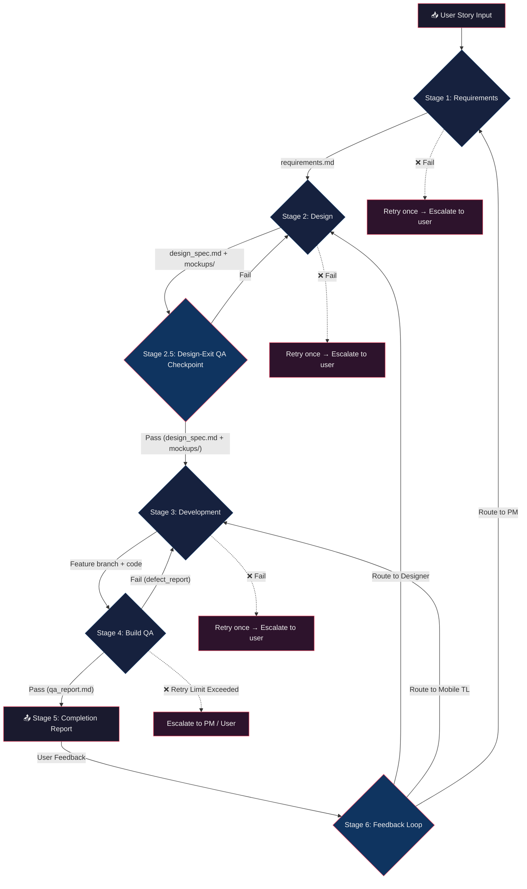

# Pipeline Stages — Detailed Definitions

> Reference document for the Pipeline Orchestrator. Defines entry criteria, exit criteria, agent configuration, expected outputs, timeouts, and failure handling for each stage.

---

## Pipeline Flowchart

---

## Stage 1 — Requirements (Project Manager)

| Attribute | Value |
|---|---|
| **Agent Role** | Project Manager (PM) |
| **Skill** | `skills/project_manager/SKILL.md` |
| **Workspace Mode** | `inherit` |
| **Timeout** | 300 seconds |

### Entry Criteria
- Raw user story text is available (provided by the user to the orchestrator).
- The story contains at minimum a user persona, an action, and a goal (even if informally stated).

### Expected Outputs
| Output | Path | Description |
|---|---|---|
| Requirements document | `pipeline_output/requirements.md` | Structured requirements with user stories, acceptance criteria, edge cases, technical constraints, and out-of-scope items |

### Exit Criteria
All of the following must be true:
1. `pipeline_output/requirements.md` exists and is non-empty.
2. The document contains at least **one user story** in the format "As a [role], I want [action] so that [goal]".
3. The document contains an **Acceptance Criteria** section with at least one testable criterion.
4. The document contains an **Edge Cases** section (may be empty if none apply, but section must exist).

### Tool Grants
- `enable_write_tools`: **true** (needs to create requirements.md)
- `enable_mcp_tools`: **false**
- `enable_subagent_tools`: **false**

### Failure Handling
1. If the PM subagent goes idle without producing `requirements.md`, **retry once** with an explicit reminder to create the file.
2. If the retry also fails, **escalate to the user** with a message explaining what went wrong and the partial output (if any).
3. If the document exists but fails exit criteria validation, send a message to the PM agent requesting corrections, then re-validate.

---

## Stage 2 — Design (Designer)

| Attribute | Value |
|---|---|
| **Agent Role** | Designer |
| **Skill** | `skills/designer/SKILL.md` |
| **Workspace Mode** | `inherit` |
| **Timeout** | 300 seconds |

### Entry Criteria
- Stage 1 is complete and all exit criteria are met.
- `pipeline_output/requirements.md` exists and has been validated.

### Expected Outputs
| Output | Path | Description |
|---|---|---|
| Design specification | `pipeline_output/design_spec.md` | Component hierarchy, color palette, typography, spacing, interaction notes |
| Mockup images | `pipeline_output/mockups/*.png` | UI mockups for each screen |

### Exit Criteria
All of the following must be true:
1. `pipeline_output/design_spec.md` exists and is non-empty.
2. The design spec contains a **Component Hierarchy** section.
3. At least **one mockup image** exists in `pipeline_output/mockups/`.
4. The design spec references the mockup file(s) by name.

### Tool Grants
- `enable_write_tools`: **true** (needs to create design docs and save images)
- `enable_mcp_tools`: **false**
- `enable_subagent_tools`: **false**

### Failure Handling
1. If the Designer subagent goes idle without producing outputs, **retry once**.
2. If the design spec exists but no mockups were generated, the stage is still considered a **soft pass** — log a warning and proceed (mockups are nice-to-have in Phase 1).
3. If the retry also fails, **escalate to the user**.

---

## Stage 2.5 — Design-Exit QA Checkpoint

| Attribute | Value |
|---|---|
| **Agent Role** | QA Engineer |
| **Skill** | `skills/qa_engineer/SKILL.md` |
| **Workspace Mode** | `inherit` |
| **Timeout** | 300 seconds |

### Entry Criteria
- Stage 2 is complete and all exit criteria are met.
- `pipeline_output/requirements.md` exists.
- `pipeline_output/design_spec.md` exists.

### Expected Outputs
| Output | Path | Description |
|---|---|---|
| Design review checklist / report | `pipeline_output/design_review_report.md` | Review log documenting requirements compliance, spec completeness, and engineering feasibility |

### Exit Criteria
All of the following must be true:
1. `pipeline_output/design_review_report.md` exists and is non-empty.
2. The report contains a clear pass/fail evaluation checklist for:
   - Compliance with PM requirements.
   - Completeness of UI specs for development (colors, layout rules, spacing).
   - Feasibility flags (no impossible layouts or components).
3. The QA agent recommends "APPROVE" for the design spec.

### Tool Grants
- `enable_write_tools`: **true** (needs to create design_review_report.md)
- `enable_mcp_tools`: **false**
- `enable_subagent_tools`: **false**

### Failure Handling
1. If QA rejects the design spec:
   - Extract defect details and route them back to the **Designer agent**.
   - The Designer must update the specifications/mockups and output the revisions.
   - Maximum of **one revision loop**. If it fails a second time, escalate to the PM or user for manual intervention.
2. If the QA subagent goes idle, retry once.

---

## Stage 3 — Development (Mobile Team Lead → Flutter Developer)

| Attribute | Value |
|---|---|
| **Agent Role** | Mobile Team Lead (spawns Flutter Developer internally) |
| **Skill** | `skills/mobile_team_lead/SKILL.md` |
| **Workspace Mode** | `branch` |
| **Timeout** | 600 seconds (longer — development is the most time-intensive stage) |

### Entry Criteria
- Stage 2 is complete and all exit criteria are met.
- `pipeline_output/requirements.md` exists and has been validated.
- `pipeline_output/design_spec.md` exists and has been validated.

### Expected Outputs
| Output | Path | Description |
|---|---|---|
| Flutter source code | `lib/features/<feature>/` | Implemented feature following MVVM architecture |
| Unit tests | `test/features/<feature>/` | ViewModel and model tests |
| Git branch | Named per conventions | Feature branch with conventional commits |

### Exit Criteria
All of the following must be true:
1. The TL sends a `[COMPLETE]` message with a **branch name**.
2. The TL reports that `flutter analyze` passes with **zero errors**.
3. The TL reports that implementation follows **MVVM architecture**.
4. At least **one commit** exists on the feature branch.

### Tool Grants
- `enable_write_tools`: **true** (needs to create files, run commands)
- `enable_mcp_tools`: **true** (may need Dart/Flutter MCP tools)
- `enable_subagent_tools`: **true** (spawns Flutter Developer subagents)

### Failure Handling
1. If the TL subagent goes idle without a completion message, **retry once** with a reminder.
2. If `flutter analyze` reports errors, send a message asking the TL to fix them, then re-validate.
3. If the retry also fails, **escalate to the user** with partial implementation details.
4. **Do not** proceed to QA if analyze errors exist.

---

## Stage 4 — QA (QA Engineer)

| Attribute | Value |
|---|---|
| **Agent Role** | QA Engineer |
| **Skill** | `skills/qa_engineer/SKILL.md` |
| **Workspace Mode** | `share` (shares the TL's branched workspace) |
| **Timeout** | 300 seconds |

### Entry Criteria
- Stage 3 is complete and all exit criteria are met.
- Feature branch exists with implemented code.
- Acceptance criteria are available from `pipeline_output/requirements.md`.

### Expected Outputs
| Output | Path | Description |
|---|---|---|
| QA report | `pipeline_output/qa_report.md` | Test results, coverage notes, pass/fail per acceptance criterion |

### Exit Criteria
All of the following must be true:
1. `pipeline_output/qa_report.md` exists and is non-empty.
2. The QA report lists **each acceptance criterion** with a pass/fail status.
3. `flutter test` has been executed and results are included in the report.
4. **All tests pass** (zero failures).

### Tool Grants
- `enable_write_tools`: **true** (needs to create test files and QA report, run `flutter test`)
- `enable_mcp_tools`: **false**
- `enable_subagent_tools`: **false**

### Failure Handling
1. If tests fail, the QA agent writes test failure details in `qa_report.md` and recommends "REJECT".
2. **Defect Backflow Loop**:
   - The Orchestrator intercepts the "REJECT" verdict, extracts defect details, and routes them back to the **Mobile Team Lead** (using their saved conversation ID).
   - The Team Lead triages the test report, identifies fixes, and delegates tasks back to the Developer subagents on the feature branch.
   - The Orchestrator increments a loop counter ($N$).
   - Once the Team Lead confirms fixes, the Orchestrator re-triggers Stage 4 (Build QA) to run all tests again.
   - **Retry Limit ($N$)**: The loop can run for a maximum of **3 cycles**. If tests still fail on the 4th run, the Orchestrator halts execution and escalates to the PM or User with the historical defect logs.
3. If the QA agent goes idle, retry once.

---

## Stage 5 — Completion Report (Orchestrator)

| Attribute | Value |
|---|---|
| **Agent Role** | Orchestrator (no subagent — the orchestrator does this directly) |
| **Workspace Mode** | N/A |
| **Timeout** | N/A |

### Entry Criteria
- All previous stages (1–4) are complete with exit criteria met.
- All artifacts exist in `pipeline_output/`.

### Expected Outputs
| Output | Path | Description |
|---|---|---|
| Completion report | `pipeline_output/completion_report.md` | Final summary of the entire pipeline run |
| User-facing summary | (sent as message) | Concise summary presented directly to the user |

### Completion Report Contents
1. **Story:** The original user story.
2. **Requirements Summary:** Key user stories and acceptance criteria.
3. **Design Summary:** Design decisions, color palette, component list.
4. **Implementation Summary:** Architecture overview, files created, MVVM compliance.
5. **Test Results:** Pass/fail summary, test count, coverage notes.
6. **Branch Name:** The feature branch ready for PR review.
7. **Artifacts:** List of all files in `pipeline_output/`.
8. **Timeline:** Duration of each stage.

### Exit Criteria
1. Completion report created at `pipeline_output/completion_report.md`.
2. Summary sent to the user via normal response output.

---

## Stage 6 — User Feedback Loop (Post-Completion)

| Attribute | Value |
|---|---|
| **Agent Role** | Orchestrator (routes feedback to PM, Designer, or Mobile TL) |
| **Workspace Mode** | Dependent on routed agent (e.g., `branch` for Mobile TL) |
| **Timeout** | Dependent on routed agent |

### Entry Criteria
- Stage 5 is complete.
- The user provides feedback, reports a bug, or requests UI changes.

### Expected Outputs
| Output | Path | Description |
|---|---|---|
| Updated implementation or design | Dependent on routing | The appropriate artifacts or codebase are updated |
| New QA report | `pipeline_output/qa_report.md` | QA runs again after any code changes |

### Exit Criteria
1. The target agent completes the revision.
2. The QA agent runs again and confirms tests pass.
3. The orchestrator presents the updated feature to the user.

### Tool Grants
- Same as original stage for the target agent.

### Branch Management
- If routing to Mobile TL, the TL **MUST** commit to the existing feature branch (`feature/<story-id>-<description>`) to keep all commits together.

---

## Stage Transition Rules

1. **Sequential only** — stages always execute in order 1 → 2 → 3 → 4 → 5. No parallel stages. No skipping.
2. **Gate validation** — the orchestrator MUST validate all exit criteria before moving to the next stage.
3. **Artifact persistence** — all artifacts from previous stages remain available to subsequent stages.
4. **Failure isolation** — a failure in one stage does not corrupt artifacts from previous stages.
5. **Single retry** — each stage gets at most one retry before escalation.
6. **Watchdog timers** — every subagent invocation must have a schedule timer set. If the timer fires before the agent completes, check on the agent's status.
